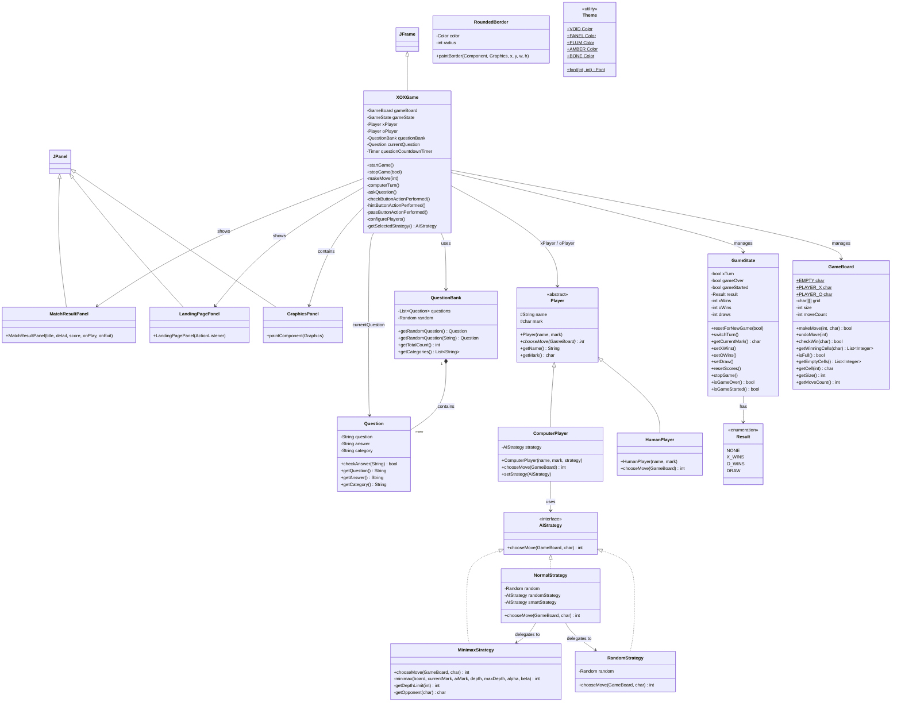

# XOX Orbit — UML Class Diagram

```mermaid
classDiagram
    direction TB

    %% ─── Swing inheritance ───────────────────────────────────
    class JFrame { }
    class JPanel { }
    JFrame  <|-- XOXGame
    JPanel  <|-- GraphicsPanel
    JPanel  <|-- LandingPagePanel
    JPanel  <|-- MatchResultPanel

    %% ─── Player hierarchy ────────────────────────────────────
    class Player {
        <<abstract>>
        #String name
        #char mark
        +Player(name, mark)
        +chooseMove(GameBoard) int*
        +getName() String
        +getMark() char
    }

    class HumanPlayer {
        +HumanPlayer(name, mark)
        +chooseMove(GameBoard) int
    }

    class ComputerPlayer {
        -AIStrategy strategy
        +ComputerPlayer(name, mark, strategy)
        +chooseMove(GameBoard) int
        +setStrategy(AIStrategy)
    }

    Player <|-- HumanPlayer
    Player <|-- ComputerPlayer

    %% ─── AI Strategy hierarchy ───────────────────────────────
    class AIStrategy {
        <<interface>>
        +chooseMove(GameBoard, char) int
    }

    class RandomStrategy {
        -Random random
        +chooseMove(GameBoard, char) int
    }

    class NormalStrategy {
        -Random random
        -AIStrategy randomStrategy
        -AIStrategy smartStrategy
        +chooseMove(GameBoard, char) int
    }

    class MinimaxStrategy {
        +chooseMove(GameBoard, char) int
        -minimax(board, currentMark, aiMark, depth, maxDepth, alpha, beta) int
        -getDepthLimit(int) int
        -getOpponent(char) char
    }

    AIStrategy <|.. RandomStrategy
    AIStrategy <|.. NormalStrategy
    AIStrategy <|.. MinimaxStrategy
    NormalStrategy --> RandomStrategy : delegates to
    NormalStrategy --> MinimaxStrategy : delegates to
    ComputerPlayer --> AIStrategy : uses

    %% ─── Game domain ─────────────────────────────────────────
    class GameBoard {
        +EMPTY char$
        +PLAYER_X char$
        +PLAYER_O char$
        -char[][] grid
        -int size
        -int moveCount
        +makeMove(int, char) bool
        +undoMove(int)
        +checkWin(char) bool
        +getWinningCells(char) List~Integer~
        +isFull() bool
        +getEmptyCells() List~Integer~
        +getCell(int) char
        +getSize() int
        +getMoveCount() int
    }

    class GameState {
        -bool xTurn
        -bool gameOver
        -bool gameStarted
        -Result result
        -int xWins
        -int oWins
        -int draws
        +resetForNewGame(bool)
        +switchTurn()
        +getCurrentMark() char
        +setXWins()
        +setOWins()
        +setDraw()
        +resetScores()
        +stopGame()
        +isGameOver() bool
        +isGameStarted() bool
    }

    class Result {
        <<enumeration>>
        NONE
        X_WINS
        O_WINS
        DRAW
    }

    GameState --> Result : has

    %% ─── Question domain ─────────────────────────────────────
    class Question {
        -String question
        -String answer
        -String category
        +checkAnswer(String) bool
        +getQuestion() String
        +getAnswer() String
        +getCategory() String
    }

    class QuestionBank {
        -List~Question~ questions
        -Random random
        +getRandomQuestion() Question
        +getRandomQuestion(String) Question
        +getTotalCount() int
        +getCategories() List~String~
    }

    QuestionBank "1" *-- "many" Question : contains

    %% ─── UI helpers ──────────────────────────────────────────
    class GraphicsPanel {
        +paintComponent(Graphics)
    }

    class RoundedBorder {
        -Color color
        -int radius
        +paintBorder(Component, Graphics, x, y, w, h)
    }

    class Theme {
        <<utility>>
        +VOID Color$
        +PANEL Color$
        +PLUM Color$
        +AMBER Color$
        +BONE Color$
        +font(int, int) Font$
    }

    class LandingPagePanel {
        +LandingPagePanel(ActionListener)
    }

    class MatchResultPanel {
        +MatchResultPanel(title, detail, score, onPlay, onExit)
    }

    %% ─── Main controller ─────────────────────────────────────
    class XOXGame {
        -GameBoard gameBoard
        -GameState gameState
        -Player xPlayer
        -Player oPlayer
        -QuestionBank questionBank
        -Question currentQuestion
        -Timer questionCountdownTimer
        +startGame()
        +stopGame(bool)
        -makeMove(int)
        -computerTurn()
        -askQuestion()
        -checkButtonActionPerformed()
        -hintButtonActionPerformed()
        -passButtonActionPerformed()
        -configurePlayers()
        -getSelectedStrategy() AIStrategy
    }

    XOXGame --> GameBoard      : manages
    XOXGame --> GameState      : manages
    XOXGame --> Player         : xPlayer / oPlayer
    XOXGame --> QuestionBank   : uses
    XOXGame --> Question       : currentQuestion
    XOXGame --> GraphicsPanel  : contains
    XOXGame --> LandingPagePanel : shows
    XOXGame --> MatchResultPanel : shows
```
